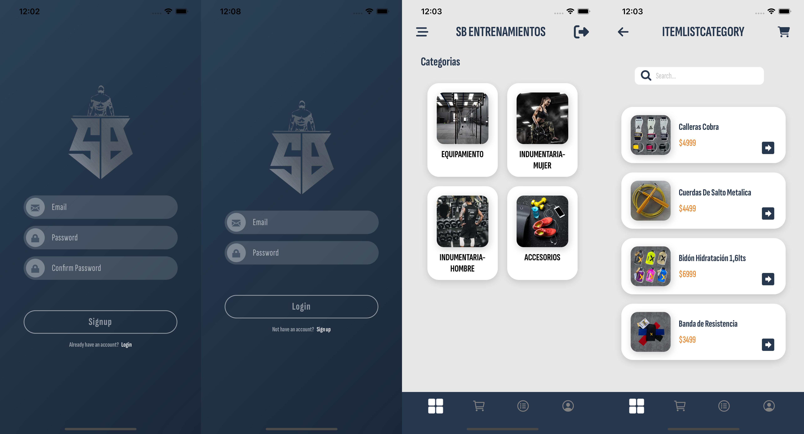

# SBEntrenamientos - Ecommerce
<a name="readme-top"></a>

<!-- TABLE OF CONTENTS -->
## 📗 Tabla de contenidos

- [📗 Tabla de contenidos ](#-table-of-contents)
- [📖 Sobre el Proyecto ](#-sobre-el-proyecto-)
  - 🛠 [Construido con](#construido-con)
    - [Funcionalidades del Proyecto](#funcionalidades-del-proyecto)
  - [🚀 Demo ](#-demo-)
  - 💻 [Comenzando](#comenzando)
    - [Pre-requisitos](#pre-requisitos)
    - [Instalación](#instalación)
    - [Deployment](#deployment)
  - [👥 Autor ](#-autor-)
  - [📝 Licencia ](#-licencia-)

<!-- PROJECT DESCRIPTION -->

## 📖 Sobre el Proyecto <a name="sobre-el-proyecto"></a>

"SB Entrenamientos" es un proyecto creado para la cursada REACT NATIVE de CODERHOUSE. Se trata de una aplicación Ecommerce donde podes comprar indumentaria o equipamiento para poder hacer calistenia en tu casa o donde quieras. 




## 🛠 Construido con <a name="construido-con"></a>

Lista de Frameworks / Libraries que vas a necesitar

* [![React][React.js]][React-url]
* [![Node][Node.js]][Node-url]
* [![Firebase][Firebase.com]][Firebase-url]
* [![Laravel][Laravel.com]][Laravel-url]
* [![Redux][Redux.com]][Redux-url]
* [![VisualStudioCode][Visualstudio.com]][VSC-url]
* [![SQLite][Sqlite.com]][SQLite-url]
* [![Android][Android.com]][Android-url]
* [![iOS][iOS.com]][iOS-url]

## Funcionalidades del Proyecto

- `Funcionalidad 1`: Sistema de Registro y Login en Firebase
- `Funcionalidad 2`: Visualización de productos por categorías
- `Funcionalidad 3`: Menu para filtrar productos
- `Funcionalidad 4`: Acceso a la descripción de cada producto
- `Funcionalidad 5`: Carrito de compras
- `Funcionalidad 6`: Agregar, eliminar productos, vaciar carrito.
- `Funcionalidad 7`: Generación de orden de compra
- `Funcionalidad 8`: Sección de Perfil de usuario con agregado de imagen y ubicación con mapas.
- `Funcionalidad 9`: Cargar productos desde firebase

<p align="right">(<a href="#readme-top"> Ir arriba </a>)</p>

<!-- DEMO -->
## 🚀 Demo <a name="demo"></a>

Mira el Deployment a continuación para conocer el proyecto.

[](https://react-js-pf-sdrigotti-rodrigo.vercel.app/)

## 💻 Comenzando <a name="comenzando"></a>

### Pre-requisitos

Elementos que necesitas para correr este proyecto:

* GitHub
* Code Editor
* Firebase
* Node js
* Expo CLI

#### Instalación 

Instrucciones para setear tu app.

1. Clonar el repositorio
   ```sh
   git clone https://github.com/rodrigosdrigotti/DA-Ecommerce-SdrigottiRodrigo.git
   ```
2. Install NPM packages para inicilizar el proyecto
   ```sh
   npm install
   ```
3. Para las librerias.
   ```sh
   - npx expo install expo-font
   - npm install @react-navigation/native
   - npx expo install react-native-screens react-native-safe-area-context
   - npm install @react-navigation/native-stack
   - npm install @react-navigation/bottom-tabs
   - npm install @reduxjs/toolkit react-redux
   - npx expo install expo-image-picker
   - npx expo install expo-media-library
   - npm i expo-location
   - npx expo install expo-sqlite
   ```
4. Para la carpeta de producción-web.
   ```sh
   npx expo export: web
   ```

<p align="right">(<a href="#readme-top"> Ir arriba </a>)</p>

### Deployment

Puedes hacer un deploy del proyecto con Netlify o visualizarlo en un emulador o traves del explorador.

npm start y seleccionar la letra correspondida.

```sh
a | android
i | ios
w | web
```

## 👥 Autor <a name="autor"></a>

- **Rodrigo Sdrigotti**

- GitHub: [@rodrigosdrigotti](https://github.com/rodrigosdrigotti)


## 📝 Licencia <a name="licencia"></a>

Distribuido bajo la licencia [MIT](https://choosealicense.com/licenses/mit/). Mirá `LICENSE.txt` para más información.


<p align="right">(<a href="#readme-top">back to top</a>)</p>

[React.js]: https://img.shields.io/badge/react_native-%2320232a.svg?style=for-the-badge&logo=react&logoColor=%2361DAFB
[React-url]: https://reactnative.dev/
[Node.js]: https://img.shields.io/badge/node.js-6DA55F?style=for-the-badge&logo=node.js&logoColor=white
[Node-url]: https://nodejs.org/es
[Firebase.com]: https://img.shields.io/badge/Firebase-FF6F00?style=for-the-badge&logo=firebase&logoColor=white
[Firebase-url]: https://firebase.google.com/
[Laravel.com]: https://img.shields.io/badge/Javascript-FF2D20?style=for-the-badge&logo=javascript&logoColor=white
[Laravel-url]: https://laravel.com
[Redux.com]: https://img.shields.io/badge/redux-%23593d88.svg?style=for-the-badge&logo=redux&logoColor=white
[Redux-url]: https://redux-toolkit.js.org/
[Visualstudio.com]: https://img.shields.io/badge/Visual%20Studio%20Code-0078d7.svg?style=for-the-badge&logo=visual-studio-code&logoColor=white
[VSC-url]: https://code.visualstudio.com
[SQLite.com]: https://img.shields.io/badge/sqlite-%2307405e.svg?style=for-the-badge&logo=sqlite&logoColor=white
[SQLite-url]: https://docs.expo.dev/versions/latest/sdk/sqlite/react-native-sqlite-storage
[Android.com]: https://img.shields.io/badge/Android-3DDC84?style=for-the-badge&logo=android&logoColor=white
[Android-url]: https://developer.android.com/about?gclid=Cj0KCQjw3JanBhCPARIsAJpXTx7YGLlZRPqNX8fJ2yq3Xy64T5uYQ0jBUy9DuXLT005b2Jd_w82Q0FIaAp4MEALw_wcB&gclsrc=aw.ds&hl=es-419
[iOS.com]: https://img.shields.io/badge/iOS-000000?style=for-the-badge&logo=ios&logoColor=white
[iOS-url]: https://www.apple.com/la/ios/ios-16/
